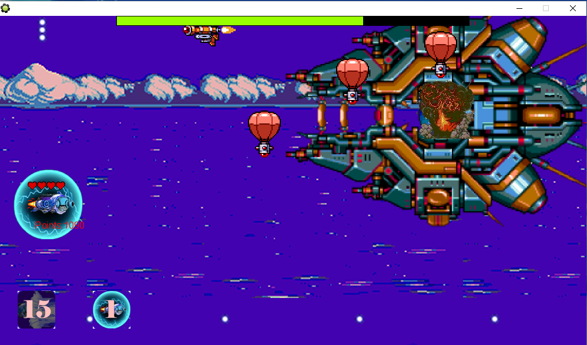

# Airaid-project
A horizontal scroll shooting game developed as a hobby project in Game Maker 8 Pro
<br/>
See `Airaid.png` for preview.


## Installation Instructions
Executable file available: `Air Raid.exe`
<br />
Scripts available in Project.gmk (Game Maker 8 file). Download to debug and edit.<br/>


## In-game Control Instructions
### Basic Controls
```
- SPACE -> Shoot Bullets
- ARROW Up -> Raise altitude
- ARROW Down -> Lower altitude
- ARROW Right -> Accelerate
- ARROW Left -> Decelerate 
```

### Ability (Available after ability capsule is consumed)
```
CONTROL - Charged Beam (High Damage Attack with Cooldown)
B - Barrier (Defend Against All Incoming Attacks for a duration of time)
```

### Saving and Loading Game (In-game)
```
S - Save Game
L - Load Game
```
